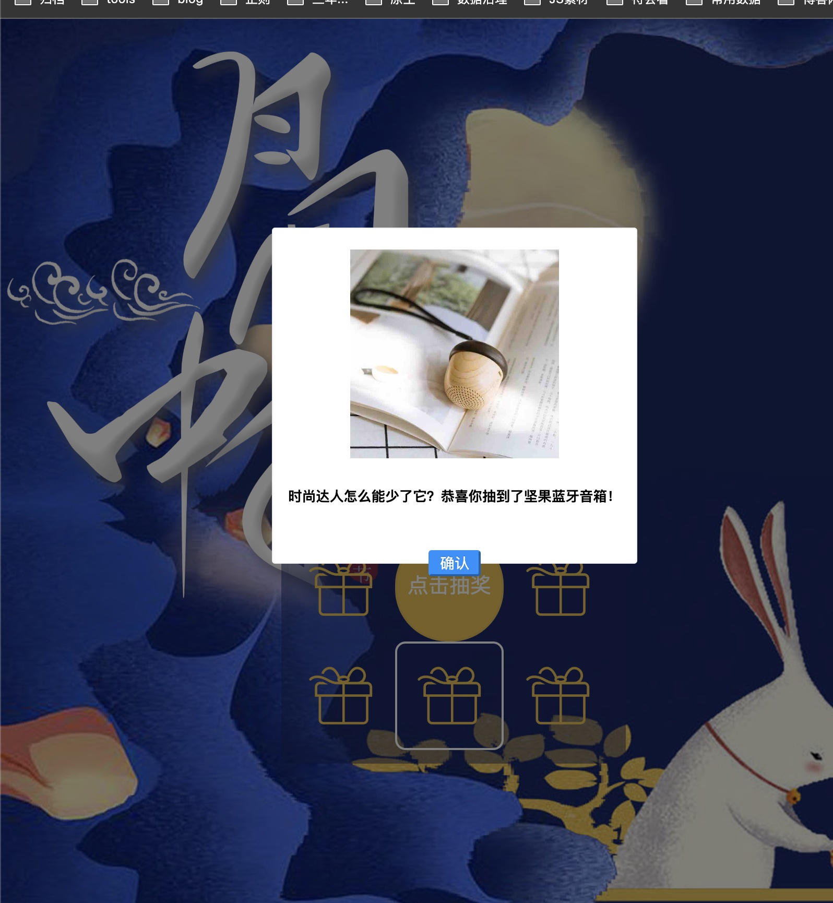

# 部门中秋节节日活动页面
## 背景
部门助理手上有一系列奖品，希望通过活动页面随机分发奖品，并最终希望获取奖品和人对应的列表
```javascript
// config/conf.js 奖品list
{
    '大闸蟹礼券': 7,
    '花点时间月卡套餐': 28,
    '坚果蓝牙音箱': 43,
    '小夜灯': 63
}
// asset/rect.js 参与抽奖的用户邮箱名称
var userList = ['xiongyujun','tony','Alice'];
```
## 使用方法
- 启动服务: node run start
- 访问页面: http://127.0.0.1:8811/asset/game.html
- 获取抽奖结果list: 查看asset/prize.txt
```
2023/10/6 11:41:15,xiongyujun,坚果蓝牙音箱
2023/10/6 11:42:35,tony,坚果蓝牙音箱
2023/10/6 11:45:25,Alice,坚果蓝牙音箱
```
## 预览截图

